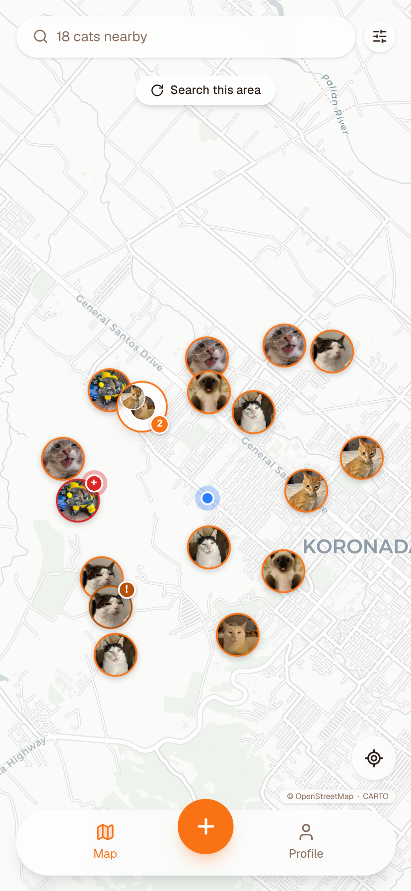
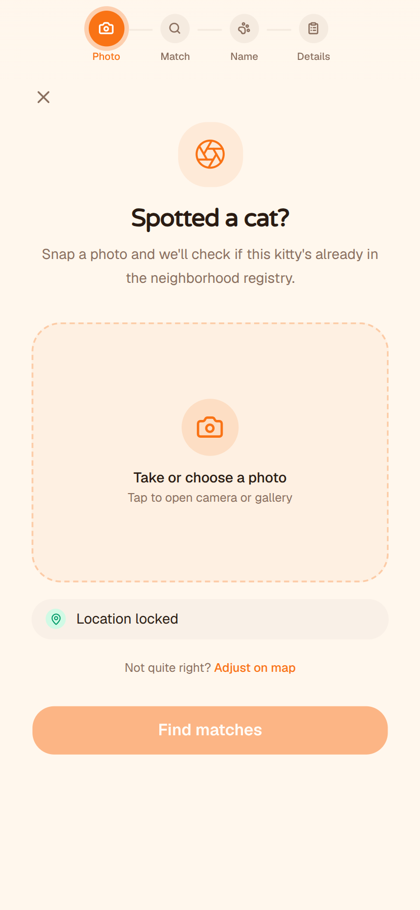
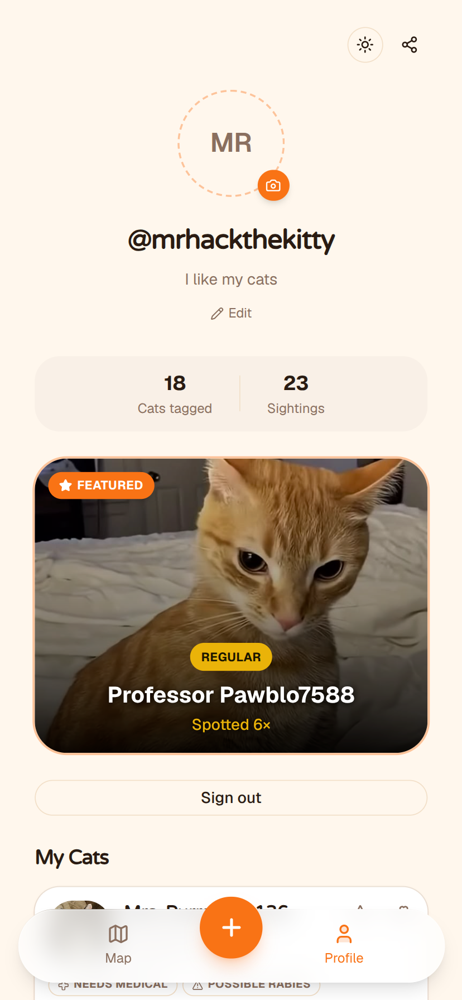
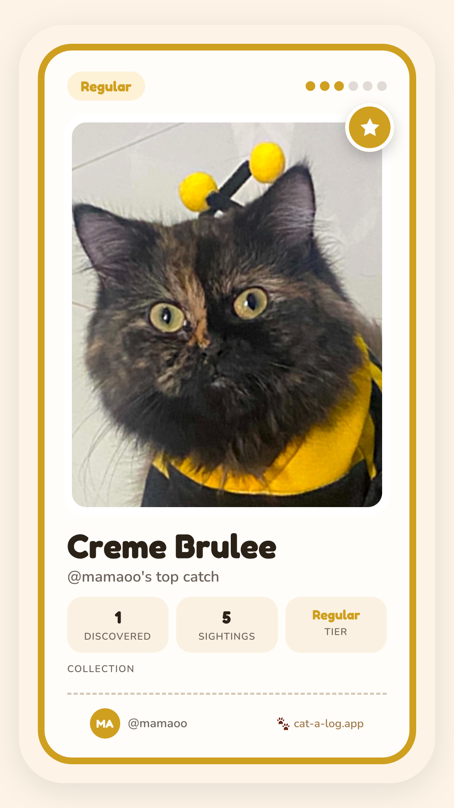

# Cat-A-Log

<p align="center">
  
  
  
  
</p>

<p align="center">
  <a href="https://github.com/oreocapybara/cat-a-log">GitHub</a> · <a href="https://cat-a-log-oreo.vercel.app">Live Demo</a>
</p>

A crowdsourced stray cat registry. Tag cats you spot with a photo and GPS location, view them on a map, and help the community track and care for neighborhood strays. Built as a mobile-first progressive web app.

**Stack:** Next.js 16 · TypeScript · Supabase · Tailwind CSS · Voyage AI

## Features

### 🗺️ Interactive Cat Map

- Real-time map showing all tagged cats in your area as photo markers with orange ring borders
- GPS-based nearby cat discovery using PostGIS spatial queries
- Smart marker clustering — groups overlapping pins at low zoom, expands on tap
- "Search this area" pill for exploring beyond your initial radius
- Cat name search bar with autocomplete — fly to any cat on the map
- Filter sheet — filter by ear-tipped (TNR) status or welfare tags (needs medical, possible rabies, deceased)
- Cat preview card — tap any marker to see name, photo, sighting count, tier, distance, and welfare flags
- Locate me button with follow mode — continuously tracks your position
- Welfare indicator badges on markers (color-coded urgency levels)
- Resolve/unresolve welfare tags directly from the map card

### 📸 Tag a Cat (Photo-First Catch Flow)

- Multi-step wizard: Photo → Match → Name → Details
- Camera or gallery photo capture with image editing (crop/resize)
- Auto GPS lock from device location with manual "Adjust on map" fallback (interactive Leaflet picker)
- **AI-powered duplicate detection** — compares your photo against nearby cats using Voyage AI multimodal embeddings (`voyage-multimodal-3`) and pgvector cosine similarity re-ranking
- Candidate matching screen (max 2 candidates + "None of these" to reduce cognitive load)
- If matched to an existing cat: add a new sighting with optional welfare tags and notes
- If new cat: name it (or get a random fun name), mark TNR status, add notes, attach welfare flags
- Shareable catch card generated on successful tag

### 🃏 Shareable Catch Cards

- Auto-generated collectible-style cards for each cat you tag
- Tier system based on sighting count: Stray → Lurker → Regular → Local Celebrity → Street Royalty → Urban Legend
- Tier-specific visual styling (colors, accents, glow effects for top tiers)
- Share via Web Share API (mobile) or download as PNG (desktop)
- OG image generation for social media link previews (Open Graph + Twitter cards)

### 👤 User Profiles

- Google OAuth sign-in (Supabase Auth)
- Custom username + bio on first setup
- Avatar upload with live preview
- Public profile pages (`/profile/:username`) with social media card metadata
- Stats: cats tagged count + total sightings across all your cats
- Featured cat card — auto-selects your most-spotted cat, or manually pin one
- "My Cats" list with welfare tags, sighting counts, and tier badges
- Theme toggle (light/dark mode)

### 🏥 Welfare & Medical Flags

- Tag cats with fixed vocabulary: `needs_medical`, `possible_rabies`, `deceased`
- TNR (Trap-Neuter-Return) status tracked via ear-tipped field
- Color-coded urgency on map markers and preview cards
- Community members can resolve flags when issues are addressed (with undo support)

### 📱 Progressive Web App

- Installable on mobile (standalone display, home screen icon)
- Service worker with network-first caching strategy
- Offline support for static assets and previously visited pages
- Portrait-primary orientation lock
- Orange theme color matching the app brand

### 🔒 Security

- Row-Level Security (RLS) on all Supabase tables
- Proxy-based route guard — unauthenticated users redirected to login
- Session refresh on every request
- Safe redirect validation (prevents open redirects)
- Server-side and client-side Supabase client separation
- Environment variable isolation (API keys server-only)

### ♿ Accessibility

- `prefers-reduced-motion` fallback on all animations
- WCAG AA contrast on urgency/welfare colors
- 44px minimum touch targets
- Keyboard-navigable with visible focus states
- Semantic HTML with proper ARIA labels
- Mobile-first responsive design (thumb-friendly, one-handed outdoor use)

### 🛠️ Developer Experience

- TypeScript strict mode
- React Hook Form + Zod schema validation
- Vitest unit tests with coverage reporting
- Playwright end-to-end tests
- ESLint + Prettier with Husky pre-commit hooks
- GitHub Actions CI (lint → format → type-check → build → test → coverage → Lighthouse)
- Conventional Commits with auto-PR workflows
- Sentry error monitoring (client, server, edge)
- Bundle analysis

## Prerequisites

Before you begin, make sure you have:

- [Node.js 20+](https://nodejs.org/) (includes npm)
- [Git](https://git-scm.com/)
- A [Supabase](https://supabase.com/) account (free tier works)

## Clone & Install

```bash
git clone https://github.com/oreocapybara/cat-a-log.git
cd Cat-A-Log
npm ci
```

`npm ci` installs dependencies from the lockfile. It also sets up Git hooks (via Husky) that lint and format your code on commit.

## Supabase Setup

1. Go to [supabase.com](https://supabase.com/) and create a new project. Pick any name and region. You'll be asked to set a database password — save it somewhere, though you won't need it directly.

2. Once the project is created, go to **Project Settings → API**. You'll need two values from this page:

   - **Project URL** (e.g. `https://abcdefgh.supabase.co`)
   - **anon public key** (starts with `eyJ...`)

3. Link your local project to Supabase. Your project ref is the subdomain in your Project URL (the `abcdefgh` part):

   ```bash
   npx supabase link --project-ref <your-project-ref>
   ```

   If you haven't installed the Supabase CLI globally, `npx` will download it automatically. For a permanent install, see the [Supabase CLI docs](https://supabase.com/docs/guides/cli/getting-started).

4. Apply the database schema:

   ```bash
   npx supabase db push
   ```

   This creates all tables, functions, storage buckets, and security policies. You don't need to run any SQL manually.

## Environment Variables

Copy the template and fill in your values:

```bash
cp .env.example .env.local
```

| Variable                        | Where to find it                                          | Required |
| ------------------------------- | --------------------------------------------------------- | -------- |
| `NEXT_PUBLIC_SUPABASE_URL`      | Supabase → Project Settings → API → Project URL           | Yes      |
| `NEXT_PUBLIC_SUPABASE_ANON_KEY` | Supabase → Project Settings → API → anon public key       | Yes      |
| `VOYAGE_API_KEY`                | [voyageai.com](https://voyageai.com/) — create an API key | Optional |

The Voyage API key powers photo similarity search (finding visually similar cats). The app runs without it, but that feature will be disabled.

## Run the Dev Server

```bash
npm run dev
```

Open [http://localhost:3000](http://localhost:3000). The app will redirect to the login page. To sign in, you need to set up Google OAuth below.

The first start may take a moment while Next.js compiles.

## Google OAuth Setup

Google OAuth is the sign-in method. Without it, you can't log in.

### 1. Create Google OAuth credentials

1. Go to the [Google Cloud Console](https://console.cloud.google.com/)
2. Create a new project (or select an existing one)
3. Navigate to **APIs & Services → Credentials**
4. Click **Create Credentials → OAuth Client ID**
5. Choose **Web application** as the application type
6. Under **Authorized redirect URIs**, add:
   ```
   https://<your-project-ref>.supabase.co/auth/v1/callback
   ```
   Replace `<your-project-ref>` with your Supabase project ref.
7. Click **Create** and copy the **Client ID** and **Client Secret**

If Google asks you to configure an OAuth consent screen first, set it to "External" and fill in the required fields (app name and email). You can leave optional fields blank.

### 2. Configure Supabase

1. In your Supabase dashboard, go to **Authentication → Providers**
2. Find **Google** and toggle it on
3. Paste your Client ID and Client Secret

### 3. Set redirect URLs

1. In Supabase, go to **Authentication → URL Configuration**
2. Set:
   - **Site URL:** `http://localhost:3000`
   - **Redirect URLs:** `http://localhost:3000/auth/callback`

For production or Vercel preview deployments, add those domains to both the Google Console redirect URIs and the Supabase redirect URLs list.

## Available Scripts

| Command                | What it does                     |
| ---------------------- | -------------------------------- |
| `npm run dev`          | Start development server         |
| `npm run build`        | Production build                 |
| `npm run lint`         | Run ESLint                       |
| `npm run format`       | Format all files with Prettier   |
| `npm run format:check` | Check formatting without writing |
| `npm run type-check`   | TypeScript type checking         |

## Project Structure

```
app/          → Pages and routes (Next.js App Router)
  (app)/      → Authenticated app shell (map, tag, profile)
  (auth)/     → Login, register, setup-profile
components/   → Shared UI primitives (shadcn/ui)
lib/          → Utilities, Supabase clients, helpers
supabase/     → Database migrations
public/       → Static assets, service worker, manifest
```

## Contributing

See [CONTRIBUTING.md](./CONTRIBUTING.md) for development workflow, commit conventions, and CI details.

## License

[AGPL-3.0](./LICENSE)
