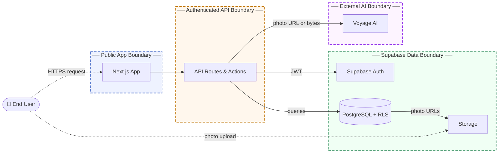

# Threat Model: Cat-A-Log

## 1. Overview

Cat-A-Log is a community-driven progressive web app built with Next.js that lets users photograph, geotag, and catalog stray cats in a shared map registry. Authenticated users tag new cats, log repeat sightings, and vote on proposals to merge duplicate cat records; the app uses AI-generated image embeddings for visual identity matching. This model covers the Next.js application, its Supabase backend, and the external Voyage AI embedding service.

Main components:

- Next.js App Router frontend and API routes (deployed on Vercel)
- Supabase: Auth (OAuth + email), PostgreSQL with row-level security, and Storage (cat photos, avatars)
- Voyage AI: external multimodal embedding API for visual cat-identity matching
- Leaflet + CARTO: client-side map rendering and tile delivery
- Service Worker: PWA offline support and asset caching

## 2. Trust Boundaries

- **Public App Boundary.** Unauthenticated users can read the map, view profiles, and load shareable catch-card images. Enforcement: server-side Supabase RLS policies grant SELECT to the public role; protected routes check for a valid session and redirect otherwise.
- **Authenticated API Boundary.** API routes and Server Actions that mutate data require a valid Supabase session. Enforcement: every handler calls `supabase.auth.getUser()` and returns 401 if no authenticated user is found.
- **Supabase Data Boundary.** The PostgreSQL database, auth service, and storage bucket are isolated from direct public access. Enforcement: RLS policies on all five tables use `auth.uid()` and `auth.role()` claims; the Next.js server presents a signed JWT for every database operation.
- **External AI Boundary.** The Voyage AI embedding API receives image data supplied by the Next.js server. Enforcement: the server authenticates with a private API key; clients never interact with Voyage AI directly.

## 3. Threat Scenarios

**Unauthorized mutation of any cat's visual embedding**
The embedding-refresh API route accepts a `catId` and a `photoUrl` from the request body and updates the target cat's stored embedding without verifying that the authenticated caller owns the cat. Any logged-in user can overwrite the visual fingerprint of a cat record they did not create, poisoning the identity-matching pipeline for other users' entries and potentially causing legitimate sightings to match the wrong animal.

- Risk: Medium likelihood, Medium impact
- Mitigation: Enforce ownership at the API layer by verifying the authenticated user's ID matches `tagged_by` on the target cat record before applying any embedding update.
- Validation: Pentest abuse case: as a non-owner authenticated account, attempt to refresh the embedding of a cat created by a different account and confirm the request is rejected.

**Server-side request forgery via attacker-controlled photo URLs**
The catch-cat and embedding-refresh endpoints accept a caller-supplied URL string that is forwarded to Voyage AI or rendered by the Next.js OG image runtime. An attacker who stores a URL pointing to cloud metadata endpoints or internal network resources can cause the Vercel serverless environment or Voyage AI's infrastructure to issue outbound HTTP requests to those addresses, potentially leaking environment metadata or confirming internal resource reachability through error responses.

- Risk: Medium likelihood, Medium impact
- Mitigation: Restrict accepted photo URLs to the application's own Supabase storage domain before passing them to any outbound service or OG image renderer.
- Validation: Code review: confirm all paths that call `getImageEmbedding` with a URL string or pass a URL to `ImageResponse` validate the hostname against an allowlist before executing.

**Match vote manipulation to forge community consensus**
The RLS UPDATE policy on the `match_votes` table grants write access to any authenticated user, not just the proposal's creator. An attacker with one or more accounts can directly increment or decrement vote counts on any pending proposal, bypassing the intended three-vote threshold and forcing fraudulent merges or permanent rejections of cat identity records.

- Risk: Medium likelihood, Medium impact
- Mitigation: Enforce vote integrity at the database layer by deriving `votes_confirm` and `votes_deny` from aggregating the `match_vote_entries` table in a trigger or view, rather than allowing direct updates to the counter columns.
- Validation: Automated test: confirm that directly calling `UPDATE match_votes SET votes_confirm = 3` as an authenticated non-proposer is rejected by RLS, and that vote counts only change via valid inserts into `match_vote_entries`.

**Account takeover via stolen persistent session token**
Session tokens are issued as cookies after OAuth or email authentication and remain valid for their full server-configured lifetime. An attacker who obtains a valid session cookie through network interception, cross-site scripting, or device access retains complete control of the account and all its cat records, profile data, and voting history for the entire validity window, even if the legitimate user changes their password or revokes OAuth consent.

- Risk: Low likelihood, High impact
- Mitigation: Integrate Supabase's server-side session revocation so that password changes and explicit sign-out calls invalidate all existing refresh tokens for the account.
- Validation: Automated test: after a password change, confirm that a previously issued refresh token is rejected on the next use.

## 4. Architectural Fragilities

**Community consensus with no database-level vote integrity backstop.** The match-merge system's correctness depends entirely on application logic; the `votes_confirm` and `votes_deny` columns are free-standing integers that any authenticated user can update directly due to the permissive RLS UPDATE policy. There is no database trigger, computed column, or constraint that derives vote counts from the authoritative `match_vote_entries` table. A single policy misconfiguration or an API route that bypasses the intended insert-only path can silently corrupt consensus state with no secondary control to detect or prevent it. The blast radius extends to permanent, irreversible cat record merges.
